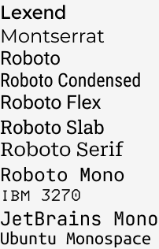

# rexarski's Toolbox

- [rexarski's Toolbox](#rexarskis-toolbox)
  - [🖥️ macOS Setup](#️-macos-setup)
    - [🛠 System Extension](#-system-extension)
    - [📁 File Management](#-file-management)
    - [🔐 Security and Encryption](#-security-and-encryption)
    - [🌏 Internet](#-internet)
    - [🧰 Utilities](#-utilities)
    - [📝 Logging](#-logging)
    - [👨🏻‍💻 Development](#-development)
    - [📷 Creative](#-creative)
    - [📮 Information](#-information)
    - [📆 Schedule](#-schedule)
    - [💬 Messaging](#-messaging)
    - [🎮 Entertainment](#-entertainment)
    - [🎑 Screensaver](#-screensaver)
    - [🔠 Font selections](#-font-selections)
  - [🔃 Service subscriptions](#-service-subscriptions)
    - [Cancelling](#cancelling)

## 🖥️ macOS Setup

New machine setup checklist

- [ ] Set up iCloud account.
- [ ] Install Chrome.
- [ ] Install 1Password.
- [ ] Install Google Drive, ~~Dropbox,~~ Maestral. Sync.
- [ ] Install Alfred.
- [ ] Install Karabiner-Elements.
- [ ] Install iTerm 2. Install [Homebrew](https://brew.sh/).
- [ ] [Change computer and host name](https://apple.stackexchange.com/questions/66611/how-to-change-computer-name-so-terminal-displays-it-in-mac-os-x-mountain-lion):
  - `sudo scutil --set ComputerName "newname"`
  - `sudo scutil --set LocalHostName "newname"`
  - `sudo scutil --set HostName "newname"`
- [ ] Stop Time Machine local snapshots.
  - `tmutil disablelocal` was deprecated since Mojave. Use  [TimeMachineEditor](https://tclementdev.com/timemachineeditor/) instead.
- [ ] Create a global `gitignore` file at `~/.gitignore`.
  - See [this one](/config/.gitignore) as an example.
  - `git config --global core.excludesfile ~/.gitignore`
- [ ] Generate and add SSH key to GitHub account.
- [ ] Turn off the iCloud sync of Photos before library migration.
- [ ] Turn off the Spotlight.
- [ ] Install essential applications in the following list.

```plaintext
A list of applications installed and/or frequently used on my device.

🎫: requires a license
🔁: requires a recurring subscription
🇺🇦: included in Setapp
🍎: downloaded from App Store
```

### 🛠 System Extension

- [AlDente](https://github.com/davidwernhart/AlDente). A macOS charging limit tool. 🎫🇺🇦
- [Alfred](https://www.alfredapp.com/). The Spotlight before Spotlight, the king of my macOS productivity. Powerpack purchased. 🎫
  - `Option` + `Space`: Activate Aflred search bar.
- [Amphetamine](https://apps.apple.com/us/app/amphetamine/id937984704?mt=12). The tool that keeps the machine awake for infinity. A true heir of [Caffeine](https://intelliscapesolutions.com/apps/caffeine). 🍎
  - `Hyper` + `A`: turn on/off
- [Bartender](https://www.macbartender.com/). macOS Menubar extension. 🎫🇺🇦
- [CleanMyMac X](https://macpaw.com/cleanmymac). A system cleaner. 🇺🇦
- [Karabiner Elements](https://karabiner-elements.pqrs.org/). Key mapping customizer.
  - `Hyper` == `Cmd + Ctrl + Option + Shift`
  - `Shift` + `Backspace`: Forward delete
  - Complex modifications: [Change `caps_lock` to `Cmd + Ctrl + Option + Shift`](https://ke-complex-modifications.pqrs.org/#modifier-keys).
- [Logi Options+](https://www.logitech.com/en-us/software/logi-options-plus.html). Customize Logitech peripherals.
- [Moom](https://manytricks.com/moom/). macOS window organizer, with more in-depth customizations than Rectangle. 🎫
  - `Hyper` + `M`: toggle Moom keyboard control.
- [Monitor Control](https://github.com/MonitorControl/MonitorControl). Control external displays.
- [腾讯柠檬清理 Tencent Lemon](https://lemon.qq.com/). Substitute for CleanMyMac X on backup machine.
- [PopClip](https://pilotmoon.com/popclip/). Mouse selection extension. 🍎
  - More [extensions](https://pilotmoon.com/popclip/extensions/)
- [Raycast](https://www.raycast.com/). Extendable launcher substitute to Spotlight, with an extension store.
  - `Hyper` + `Space`: Activate Raycast.
- [Rocket](https://matthewpalmer.net/rocket/). Emoji launcher with one-key shortcut. 🎫
  - Use ~~`~~`~~ `:` to trigger the app.
- [iStat Menus](https://bjango.com/mac/istatmenus/). Menubar system monitor. 🇺🇦
- [KeyCastr](https://github.com/keycastr/keycastr). Open source keystroke visualizer.
  - `Hyper` + `K`: Toggle capturing
- ~~[Yoink](https://eternalstorms.at/yoink/mac/). Temp file shelf. 🍎🇺🇦~~
- ~~[f.lux](https://justgetflux.com/). Control the on-screen color temperature.~~
- ~~[HazeOver](https://hazeover.com/). Dim the windows out of focus and the background to create a distraction-free workspace. 🎫🇺🇦~~
- ~~[MenubarX](https://menubarx.app/). Open up a window on the menubar. Reminds of [Macmenubar.com](https://macmenubar.com/) 🍎~~
- ~~[Rectangle](https://rectangleapp.com/). macOS window organizer.~~
  - ~~`Hyper` + `1/2/3/4`: current window to the 1st/2nd/3rd/4th quadrant of the screen~~
  - ~~`Hyper` + arrow keys~~
  - ~~`Hyper` + `C`: center~~
  - ~~`Ctrl` + `Option` + `D`: First third (depends on the orientation of the monitor, could be horizontal or vertical)~~
  - ~~`Ctrl` + `Option` + `F`: Second third~~
  - ~~`Ctrl` + `Option` + `G`: Last third~~
  - ~~`Ctrl` + `Option` + `E`: First two thirds~~
  - ~~`Ctrl` + `Option` + `T`: Last two thirds~~
- ~~[Kap](https://getkap.co/). Open source screen recorder.~~
- ~~[coconutBattery](https://coconut-flavour.com/coconutbattery/). Battery reading.~~

### 📁 File Management

- [calibre](https://calibre-ebook.com/). E-book management software.
- [DaisyDisk](https://daisydiskapp.com/). Analyzing disk usage with a wind rose diagram. 🍎
- [DEVONthink 3](https://www.devontechnologies.com/apps/devonthink). Organize async files, as the counterpart of my cloud storage. 🎫
- [Maestral](https://maestral.app/). Open source Dropbox client, simpler, smaller, less memory needed.
- [Google Drive](https://www.google.com/drive/). 15GB might just be enough for now.
- [Gemini](https://macpaw.com/gemini). Duplicate finder. 🎫🇺🇦
- [Hook](https://hookproductivity.com/). Create, search robust link information on everything. 🎫
  - `Ctrl` + `H`: show Hook context window
  - `Ctrl` + `Cmd` + `Shift` + `C`: copy link
- [iMazing 2](https://imazing.com/). iOS device management. Single device allowed. 🎫
- [TimeMachineEditor](https://tclementdev.com/timemachineeditor/). Manually control Time Machine backup schedule.
  - `brew install --cask timemachineeditor`
- [Transmit](https://panic.com/transmit/). File transfer between macOS and servers. 🎫
- ~~[Dropbox](https://www.dropbox.com/home). Replaced due to the limitation of number of devices in sync.~~

### 🔐 Security and Encryption

- [1Password](https://1password.com/). THE password manager for the last decade. Requires yearly subscription. 🔁
  - `Hyper` + `P`: Open 1Password
- ~~[Encrypto](https://macpaw.com/encrypto). Encrypt files with AES-256. 🍎~~

### 🌏 Internet

The holy trinity of Safari, [Chrome](https://www.google.com/chrome/), and [Firefox](https://www.mozilla.org/en-US/firefox/new/).

- [1Blocker](https://1blocker.com/). Content blocker on Safari. 🍎
- In Safari, go to Preferences - Advanced, turn on "Show Develop menu in menu bar".

### 🧰 Utilities

- [Downie](https://software.charliemonroe.net/downie/). Internet video downloader, great browser plugins. 🇺🇦
- [Folx](https://www.mac-downloader.com/). Download manager. 🇺🇦
- [Image2icon](https://img2icnsapp.com/). Convert images to icons. 🍎🇺🇦
- [Keka](https://www.keka.io/en/). File archiver.
- [Maccy](https://maccy.app/). Open source clipboard management.
  - `Cmd` + `Shift` + `V`: show clipboard.
- [Shottr](https://shottr.cc/). Great substitute to CleanShot X.
  - `Cmd` + `Shift` + `3` = Shottr area screenshot
  - `Cmd` + `Shift` + `4` = Shottr active window screenshot
  - `Cmd` + `Shift` + `5` = Shottr fullscreen screenshot
- [CleanShot X](https://cleanshot.com/). Great screenshot and GIFs tool. 🇺🇦
  - `Cmd` + `Shift` + `3` = Capture area
  - `Cmd` + `Shift` + `4` = Capture window
  - `Cmd` + `Shift` + `5` = Capture fullscreen
  - `Cmd` + `Shift` + `6` = All-In-One
- [Dark Noise](https://darknoise.app/). White noise app. 🍎
  - ~~[Noizio](https://noiz.io/). Substituted. 🍎🇺🇦~~
- [Numi](https://numi.app/). Calculator with freedom. 🎫🇺🇦
- [PCalc](https://pcalc.com/). Calculator app on macOS. 🍎
- [QLMarkdown](https://github.com/sbarex/QLMarkdown). macOS Quick Look extension for markdown files.
  - `brew install --cask qlmarkdown`
- ~~[Data Jar](https://datajar.app/). Data store for shortcuts. 🍎~~
- ~~[DeepL Translator](https://www.deepl.com/).~~
- ~~[MD Clock](https://www.miidii.tech/). Clock app. 🍎~~
- ~~[Cheatsheet](https://www.mediaatelier.com/CheatSheet/)~~. Not compatible with M1 chip.
- ~~[Transmission](https://transmissionbt.com/). A BitTorrent client.~~

### 📝 Logging

- [Day One](https://dayoneapp.com/). My daily journal app. 🍎🔁
- [Drafts](https://getdrafts.com/). One-in-all text/draft app. 🍎🔁
  - `Cmd` + `Shift` + `1` = Drafts main window
  - `Cmd` + `Shift` + `2` = Drafts quick entry
- [Goodnotes 5](https://www.goodnotes.com/). 🍎
- [MarkText](https://github.com/marktext/marktext). Open source Markdown editor.
  - ~~Substitute for [Typora](https://typora.io/)🎫~~
  - `brew install --cask mark-text`
- [Marked 2](https://marked2app.com/). Markdown preview built from a while ago. It's not that useful any more. 🎫🇺🇦
- [Notability](https://notability.com/). The old-school handwriting note app from iPad. 🍎
- [Obsidian](https://obsidian.md/). Second brain/digital garden/Zettelkasten. Use Dropbox to sync settings and vaults.
- [Craft](https://www.craft.do/). Document management + notes. 🍎🔁
- [Texpad](https://www.texpad.com/). LaTeX editor. 🎫
- ~~[HiCoffee](https://apps.apple.com/us/app/hicoffee-caffeine-tracker/id1507361706). Coffee intake tracker. 🍎~~
- ~~[HiWater](https://apps.apple.com/us/app/hiwater-the-water-pyramid/id1561732866). Water intake tracker. 🍎~~
- ~~[Streaks](https://streaksapp.com/). A habit tracker. 🍎~~
- ~~[Notion](https://www.notion.so/). The universal workspace. I'd prefer the web version.~~
  - ~~[Anytype](https://anytype.io/)/ An alternative to Notion. Offline access is its strength.~~
- ~~[Buckets](https://www.budgetwithbuckets.com/). Private family budgeting app.~~
- ~~[Mactracker](https://mactracker.ca/). Information of all Apple devices. I switched to writing down everything on a Note. 🍎~~
- ~~[jrnl](https://jrnl.sh/en/stable/). A command line journal tool.~~
- ~~[FSNotes](https://fsnot.es/). Open source notes manager for macOS and iOS.~~
- ~~[Sofa](https://www.sofahq.com/). Downtime organizer. 🍎~~

### 👨🏻‍💻 Development

- [Anaconda](https://www.anaconda.com/). Data science resource management for Python (mainly) and R (not really.)
  - I also use [poetry](https://python-poetry.org) for python package management.
  - `conda config —set auto_activate_base false`. [Do not activate `conda` by default](https://stackoverflow.com/questions/54429210/how-do-i-prevent-conda-from-activating-the-base-environment-by-default).
- [Dash](https://kapeli.com/dash). Offline access to documentations. 🎫🇺🇦
- [Docker](https://www.docker.com/). Containerization platform.
- [Expressions](https://www.apptorium.com/expressions). Nice regular expression helper. 🇺🇦
- [JetBrains Toolbox](https://www.jetbrains.com/toolbox-app/). Activated with Educational license. 🔁
  - "For the sake of the hard drive space. Don’t keep previous versions for instant rollback."
  - [WebStorm](https://www.jetbrains.com/webstorm/)
  - [DataSpell](https://www.jetbrains.com/dataspell/)
  - [PyCharm](https://www.jetbrains.com/pycharm/)
  - [DataGrip](https://www.jetbrains.com/datagrip/)
- [Fig](https://fig.io/). Auto-complete in terminal apps. Very powerful companion with iTerm 2. Plugins in-use:
  - `brew install --cask fig`
  - Plugins
    - [Oh My Zsh](https://ohmyz.sh/)
    - [Zsh Syntax Highlighting](https://github.com/zsh-users/zsh-syntax-highlighting)
    - [Zsh Autosuggestions](https://github.com/zsh-users/zsh-autosuggestions)
    - [Spaceship Prompt](https://spaceship-prompt.sh/)
    - [You Should Use](https://github.com/MichaelAquilina/zsh-you-should-use)
    - [Git Open](https://github.com/paulirish/git-open)
- [GitHub Desktop](https://desktop.github.com/). Easy-to-use Git GUI.
- [iTerm 2](https://iterm2.com/). Terminal, but better than Terminal.
  - [vimrc](https://github.com/amix/vimrc)
- [Vim](https://www.vim.org/). The editor.
- [Visual Studio Code](https://code.visualstudio.com/). Code editor.
  - Use the following script to create a `code` command in terminal:
- ~~[Warp](https://www.warp.dev). Rust-based, blazingly fast terminal with some killer features like code blocks, etc.~~
- ~~[ServerCat](https://servercat.app/). Server status, docker management and SSH client for iOS (and macOS.) 🍎~~

```bash
cat << EOF >> ~/.zprofile
# Add Visual Studio Code (code)
export PATH="\$PATH:/Applications/Visual Studio Code.app/Contents/Resources/app/bin"
EOF
```

- [Processing](https://processing.org/). Generative art playground.
- [TablePlus](https://tableplus.com/). Nicely designed database management GUI. 🇺🇦
- [Paw](https://paw.cloud/). API tool. 🇺🇦
- [julia](https://julialang.org/)
  - `brew install --cask julia`
- [R](https://www.r-project.org/). THE statistical programming language.
- [RStudio](https://www.rstudio.com/). Open source IDE for R language.
- [Quarto](https://quarto.org/). An open source scientific and technical publishing system built on Pandoc.
  - `brew install --cask quarto`
- [MacTeX](https://www.tug.org/mactex/). LaTeX distribution for macOS.
  - `brew install --cask mactex`
  - Follow this [blog](https://mathjiajia.github.io/vscode-and-latex/#step-3-install--configure-latex-workshop) to set up.
  - Restart the machine to resolve the path issue.
- [Xcode](https://developer.apple.com/xcode/). 🍎
- ~~[RSwitch](https://rud.is/rswitch/). A lightweight menubar utility for R users.~~
- ~~[Postman](https://www.postman.com/). API platform.~~
- ~~[QGIS](https://qgis.org/en/site/). Open source GIS.~~
- ~~[GitKraken](https://www.gitkraken.com/git-client). More fancy Git GUI. 🔁~~
- ~~[Cool Retro Term](https://github.com/Swordfish90/cool-retro-term). Open source retro terminal emulator.~~

### 📷 Creative

- [Affinity Designer](https://affinity.serif.com/en-us/designer/). Purchased on [App Store](https://apps.apple.com/us/app/affinity-designer/id1274090551). 🍎
- [Affinity Photo](https://affinity.serif.com/en-us/photo/). Purchased from the developer. 🎫
- [Darkroom](https://darkroom.co/). Very powerful and user-friendly photo + video editor in Apple's ecosystem. 🍎🎫
- [Figma](https://www.figma.com/) == Design Swiss Army knife.
- [Final Cut Pro](https://www.apple.com/final-cut-pro/). 🍎
  - [Motion](https://www.apple.com/final-cut-pro/motion/). 🍎
  - [Compressor](https://www.apple.com/final-cut-pro/compressor/). 🍎
- [Eagle](https://eagle.cool/). Reference images organization. 🎫
- [Aseprite](https://www.aseprite.org/). A animated pixel art editor. Purchased on [Steam](https://store.steampowered.com/app/431730/Aseprite/). 🎫
- [PhotoBulk](https://photobulkeditor.com/). Quick photo editor. 🍎
- [PICO-8](https://www.lexaloffle.com/pico-8.php). Fantasy retro console game engine. 🎫
- [Sip](https://sipapp.io/). A color picker app. 🇺🇦
- [ColorSlurp](https://colorslurp.com/) as an alternative to Sip, but free. 🍎
- [Permute](https://software.charliemonroe.net/permute/). Media convertor. 🇺🇦
- [Meta](https://www.nightbirdsevolve.com/meta/). Digital music management, a tag editor. 🇺🇦
- ~~[Capture One](https://www.captureone.com/en). Free activation code gifted with a Fujifilm camera. Not that frequently used too.~~
- ~~[Inboard](https://inboardapp.com/). Image organization. Development in hiatus. 🍎~~
- ~~[Pixen](https://pixenapp.com/). Pixel art editor. 🍎~~
- ~~[Polarr Photo Editor Pro](https://www.polarr.com/mac/). 🎫~~
- ~~[Pixelmator Classic](https://www.pixelmator.com/mac/). Full-power image editor. 🍎~~
- ~~[剪映](https://lv.ulikecam.com/). A video editor.~~
- ~~[Audacity](https://www.audacityteam.org/). Open source audio app.~~
- ~~[Handbrake](https://handbrake.fr/). Open source video transcoder.~~

### 📮 Information

- [Anki](https://apps.ankiweb.net/). A Open source flashcard tool.
- [CARROT Weather](https://www.meetcarrot.com/weather/). 🍎
- [Deliveries](https://deliveries.app/en.html). Package tracking. 🍎
- [Reeder](https://reederapp.com/). RSS reader. 🍎
  - `Q`: Copy link
  - `W`: Add to Instapaper
  - `E`: Open in Chrome
- [PDF Expert](https://pdfexpert.com/). PDF editor and reader. 🎫
- [Pocket Casts](https://pocketcasts.com/). Third-party podcast client. 🎫
- [Tweetbot](https://tapbots.com/tweetbot/mac/). Third-part Twitter client after all those years, still standing. 🍎
- [小宇宙](https://www.xiaoyuzhoufm.com/). 用来收听中文独占播客的客户端。🍎
- ~~[Pins](https://get-pins.app/). Modern Pinboard app on macOS. 🍎~~
- ~~[MindNode](https://www.mindnode.com/). 🎫🇺🇦~~
- ~~[NetNewsWire](https://netnewswire.com/). Open source RSS reader.~~
- ~~[Skim](https://skim-app.sourceforge.io/). An open source PDF reader and note taker.~~
- ~~[Spark](https://sparkmailapp.com/). Email client. 🍎~~
- ~~[Maipo](https://apps.apple.com/us/app/maipo-for-weibo/id789066512?mt=12). Third-party Weibo client. 🍎~~

### 📆 Schedule

- [Due](https://www.dueapp.com/). Aggressive reminder app. 🍎🇺🇦🔁.
  - `Hyper` + `D`: create new reminder.
- [Fantastical](https://flexibits.com/fantastical). A calendar and todo list app with great NLP input. 🎫
  - `Hyper` + `F`: create new event/reminder
- [Things 3](https://culturedcode.com/things/). The best GTD from my perspective. 🍎
  `Ctrl` + `Space`: quick entry.
- ~~[Itsycal for Mac](https://www.mowglii.com/itsycal/). A menubar calendar.~~
- ~~[Clear](https://apps.apple.com/us/app/clear-todos/id493136154). One of the GTD apps with the best interactions. Deprecated. What a pity. 🍎~~

### 💬 Messaging

- [Discord](https://discord.com/).
  - Or [Swiftcord](https://swiftcordapp.github.io/Swiftcord/). A native Discord client for macOS.
- [微信 WeChat](https://www.wechat.com/). Hate it but have to.
- [Zoom](https://zoom.us/). For conference meeting, of course.
- [Slack](https://slack.com/). Workspace communication.
- [Telegram](https://telegram.org/). IM.
- [Mumble](https://www.mumble.info/). Open source voice chat.
- ~~[Microsoft Teams](https://www.microsoft.com/en-us/microsoft-teams/group-chat-software)~~

### 🎮 Entertainment

- [Amazon Kindle](https://www.amazon.com/b?ie=UTF8&node=16571048011). 🍎
- Books. System built-in EPUB reader.
- [IINA](https://iina.io/). Open source media player.
- [Spotify](https://open.spotify.com/)
- [Steam](https://store.steampowered.com/)
- Battle.net
  - [Hearthstone](https://playhearthstone.com/en-us). Collectible card game.
  - [HSTracker](https://hsreplay.net/downloads/). Hearthstone deck tracker.
- ~~[YACReader](https://www.yacreader.com/). A cross-platform comic reader.~~
- ~~[OpenEmu](https://openemu.org/). Retro game emulator.~~
- ~~[OpenRA](https://www.openra.net/). C&C, Dune, RA built for modern era.~~

### 🎑 Screensaver

- [Brooklyn](https://github.com/pedrommcarrasco/Brooklyn). Screensaver inspired by Apple's Event on October 30, 2018.
- [Fliqlo Flip Clock](https://fliqlo.com/). The classic.
- [fruit](https://github.com/Corkscrews/fruit). Retro Apple.
- ~~[Aerial](https://github.com/JohnCoates/Aerial). Apple TV Aerial Screensaver.~~

### 🔠 Font selections

- [Readex Pro (~~Lexend~~)](https://www.lexend.com/), sans serif
- [Montserrat](https://fonts.google.com/specimen/Montserrat), sans serif
- Roboto family
  - [Roboto](https://fonts.google.com/specimen/Roboto), sans serif
  - [Roboto Condensed](https://fonts.google.com/specimen/Roboto+Condensed), sans serif
  - [Roboto Flex](https://fonts.google.com/specimen/Roboto+Flex), sans serif
  - [Roboto Slab](https://fonts.google.com/specimen/Roboto+Slab), serif
  - [Roboto Serif](https://fonts.google.com/specimen/Roboto+Serif), serif
  - [Roboto Mono](https://fonts.google.com/specimen/Roboto+Mono), monospace
- [IBM 3270](https://github.com/rbanffy/3270font), monospace
- [JetBrains Mono](https://www.jetbrains.com/lp/mono/), monospace
- [Ubuntu Monospace](https://design.ubuntu.com/font/), monospace



- [Noto Mono for Powerline](https://github.com/powerline/fonts/), monospace

## 🔃 Service subscriptions

- [YouTube Premium](https://www.youtube.com/premium)
- [Amazon Prime](https://www.amazon.com/amazonprime)
- [Netflix](https://www.netflix.com/)
- [The Athletic](https://theathletic.com/)
- [Netlify](https://www.netlify.com/)
- [GoDaddy](https://www.godaddy.com/)
- [Feedbin](https://feedbin.com/)
- [Spotify](https://open.spotify.com/)
- [FlowingData](https://flowingdata.com/membership/)
- [1Password Family](https://1password.com/families/)
- [Day One](https://dayoneapp.com/)
- [CARROT Weather](https://www.meetcarrot.com/weather/)
- [Craft](https://www.craft.do/)
- [Tweetbot for iOS](https://tapbots.com/tweetbot/)
- [Nintendo Switch Online](https://www.nintendo.com/switch/online-service/)
- [F1 TV Pro](https://f1tv.formula1.com/)
- [Setapp](https://setapp.com/)
- [不在场](https://buzaichang.zhubai.love/)
- [HBO Max](https://www.hbomax.com/)


### Cancelling

- ~~[Pinboard](https://pinboard.in/)~~
- ~~[NOMO CAM](https://apps.apple.com/us/app/nomo-cam-point-and-shoot/id1362548649)~~
